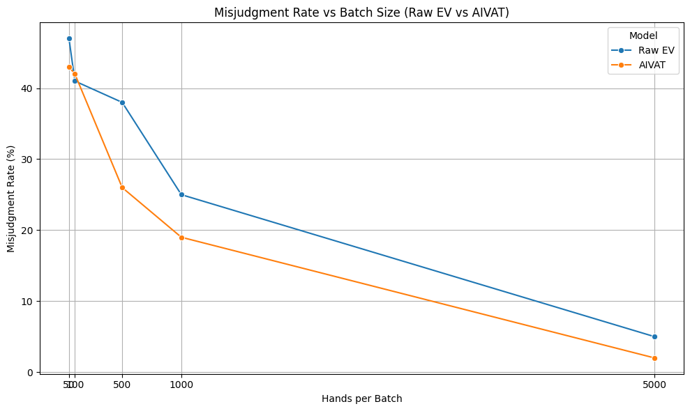

# 🧠 AIVAT Simulation for Poker Strategy Evaluation (Heads-Up AOF)

This notebook implements a simplified heads-up All-in or Fold (AOF) poker simulation framework to evaluate and compare poker strategies.  
It focuses on demonstrating how AIVAT (Action-Informed Value Assessment Tool) can reduce variance in EV (expected value) estimates — especially in small-sample scenarios where variance typically distorts strategy evaluation.

---

## 📌 Project Highlights

- 🎯 Compares two simple strategies (A and B) based on hand strength thresholds
- 🔁 Simulates repeated heads-up AOF games using random hands
- 📊 Measures and visualizes variance reduction effects with AIVAT
- 📉 Tracks misjudgment rates under raw EV vs AIVAT
- 📚 Uses statistical tests (F-test) to confirm the significance of variance reduction

---

## 🚀 Run in Google Colab

Click the badge below to launch this notebook in Colab:

[](https://colab.research.google.com/github/LeonLaigogo/Side-Project-AIVAT-Simulation-for-Poker-Strategy-Evaluation/blob/main/Side_Project_AIVAT_Simulation_for_Poker_Strategy_Evaluation.ipynb)

---

## 🔬 How It Works

- Each player receives a random hand with strength from 1 to 10
- Strategy A goes all-in with hands ≥ 7  
  Strategy B goes all-in with hands ≥ 5
- Simulations evaluate which strategy performs better over many games
- AIVAT is used to correct variance in value estimation using control variates
- Outputs include per-hand results, batch-level variance, and EV comparison plots

---

## 📈 Sample Result Summary

- ✅ **Strategy B outperforms Strategy A in the long run**
- ⚠️ In small samples, raw EV may be misleading
- ✅ **AIVAT reduces EV variance significantly**
- 📊 In a 100-batch experiment, raw EV variance = 0.0181, AIVAT variance = 0.0076  
- ✅ F-test confirmed statistical significance (F = 2.39, p ≪ 0.05)

## 🖼️ Visualization

### 📊 Misjudgment Rate vs Sample Size (Raw EV vs AIVAT)

<p align="center">
  
</p>

This figure compares how AIVAT and Raw EV perform under different sample sizes.  
AIVAT stabilizes faster and delivers more consistent win-rate estimation, especially in high-variance, low-sample environments.

---

## 📂 Project Structure
<pre lang="text"><code> ``` Side-Project-AIVAT-Simulation-for-Poker-Strategy-Evaluation/ ├── assets/ ← Image folder for visualizations │ └── misjudgment_rate_vs_sample_size.png ← AIVAT vs Raw EV plot ├── Side_Project_AIVAT_Simulation_for_Poker_Strategy_Evaluation.ipynb ← Main simulation notebook └── README.md ← Project documentation ``` </code></pre>

---

## 🧠 Ideal Use Cases

- Evaluating poker strategy performance with fewer samples
- Exploring AIVAT as a variance reduction tool in game simulations
- Teaching poker AI methods or reinforcement learning evaluation
- Running batch experiments to compare simplified strategies

---

## 📬 Author

Developed by [@LeonLaigogo](https://github.com/LeonLaigogo)  
Date: 2025-03-24

---

## ⭐ Like this notebook?

If you find this project useful, feel free to ⭐ star the repo and share feedback!

